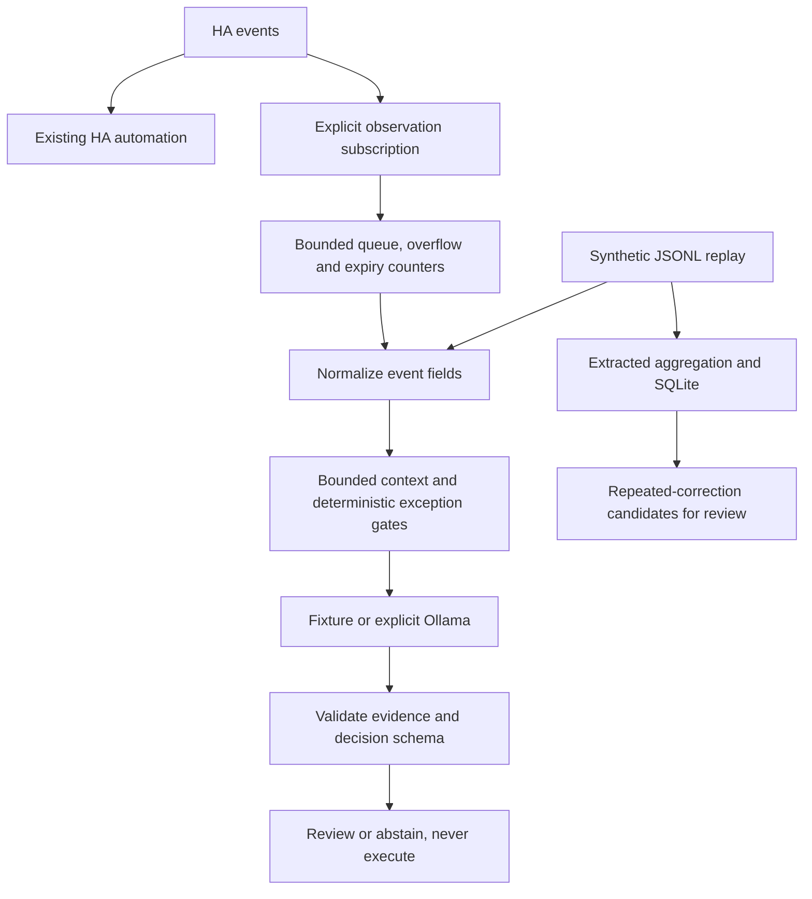

# Architecture

Existing HA automation has no dependency on this service. This observer cannot suppress or undo an action that HA already performed. Device-control integration is intentionally absent from this release.

## Event contract

Each JSONL row requires strings: `id`, `ts` (timezone-aware ISO 8601), `entity_id`, `state`, `kind` (`presence`, `robot`, `device`, `environment`), `source` (`system`, `manual`, `automation`). Optional `area` groups related entities. Unknown fields are stripped. Required strings are at most 160 characters; area is at most 80. Replay input must be time-ordered; late live events are skipped.

HA projection only includes configured entities, maps IDs to explicit aliases, derives an area from the alias prefix, drops friendly names/location/user IDs, and hashes a per-event context identifier with the alias, timestamp and state (this is not an anonymity guarantee). Source classification from HA context is a heuristic, not proof that a person reversed an automation.

## Bounds and limitations

Retain at most `max_events` events newer than `max_age_seconds`; trim the complete serialized Ollama request to `max_context_chars` bytes of ASCII-escaped JSON, including model name, fixed system prompt, options and message envelope. Character count equals byte count for this ASCII encoding; it is not a tokenizer-level limit. Output is separately limited to 512 requested generation tokens and 64 KiB received JSON. Event selection counts escaped lengths once, then retains the newest suffix in linear time. Old evidence may be lost; hierarchical compression is future work.

Deduplication remembers at most twice `max_events` IDs. Cooldowns and per-window call keys are bounded by `max_events`. A single consumer performs model calls off the event loop with a 30-second socket I/O timeout. This is not a guaranteed end-to-end inference deadline. A separate producer receives messages into a queue capped by `queue_capacity`; newest arrivals are dropped when full. Items older than `max_queue_age_seconds` in that queue are skipped before analysis. Metrics expose malformed messages, late events, overflow, expiry, peak queue size, cooldown skips and inference-budget skips. The WebSocket library also has a bounded 16-frame receive queue and a 1 MiB message limit. Cancellation may wait for an in-flight blocking request to return; reconnect and durable ingestion remain unimplemented.

Replay uses a temporary SQLite database removed on exit, with one connection and one transaction per replay. `Database.batch()` offers the same atomic fast path to other callers; standalone operations retain individual transactions for compatibility. Exceptions escaping the batch roll back; nested batches and backups within open batches are rejected. Backup connections are explicitly closed. Environment aggregation maintains count/sum/min/max/first/last per entity instead of accumulating every sample. At the entity cap, only the oldest buffered entity is flushed; idle cooldown entries remain bounded and are pruned on the next event, avoiding a background timer. Replay result lists are capped; `decisions_truncated` reports omitted older results. Disk usage still grows with replay size. Extracted sensor-staleness detection uses last recorded event time, which alone cannot distinguish a quiet sensor from a disconnected sensor.

## Decisions

Providers return exactly `decision`, `reason_code`, `evidence`, `explanation`, `uncertainty`. Only `review` and `abstain` are accepted. Review requires existing evidence IDs. The pipeline adds `executed: false` and provider identity. Exceptions yield abstention without exposing raw exception text.

Repeated corrections generate review candidates, not synthesized rules. The retained memory confidence function is an uncalibrated heuristic; user-confirmed scores must not be interpreted as measured accuracy.

Machine-readable reference schemas are in `schemas/`. Runtime validators additionally enforce timezone presence, evidence membership, nonempty review evidence, unique aliases and endpoint opt-in. Unknown event fields are stripped; unknown config/decision fields are rejected.
